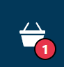
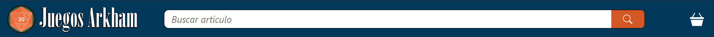
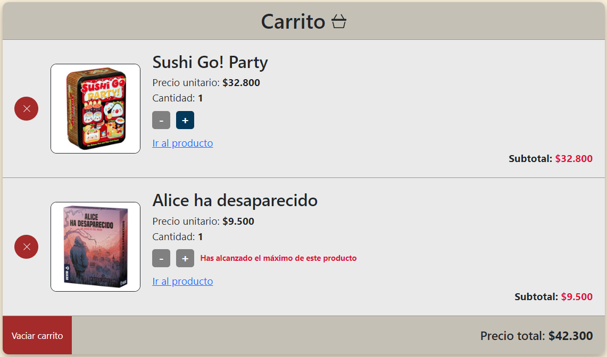
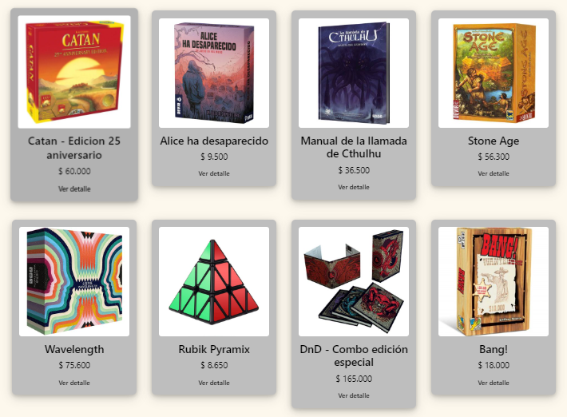
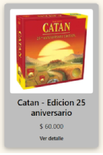
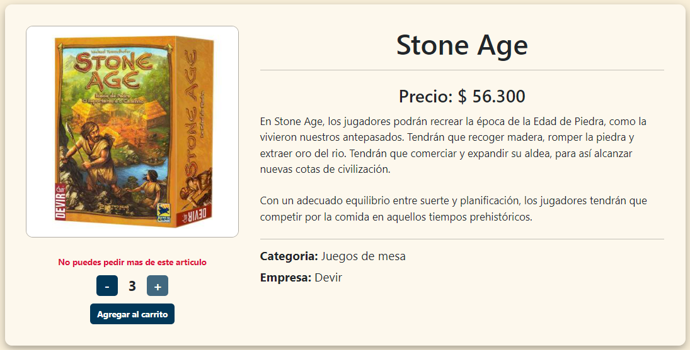

# Proyecto final de React JS: Juegos Arkham

Este proyecto es una aplicacion web desarrollada con React JS, una librería de Javascript de código abierto que ofrece grandes beneficios en rendimiento, modularidad y promueve un flujo muy claro de datos y eventos, facilitando la planeación y desarrollo de apps complejas.

## Herramientas

### Lenguajes

- HTML 5
- CSS 3
- Javascript

### Frameworks

- Bootstrap
- Node JS

### Librerias

- React JS
- Tostify
- Sweet Alert

### Base de datos

- Firebase

### Software de control de versiones

- git

### Diseño de imágenes

- Adobe Ilustrator

## Links

- **Repositorio:** https://github.com/FacuCampos/EntregaFinal-Campos
- **Deployment:** https://entrega-final-campos.vercel.app/

## Modelos previos

Se utilizo como modelo para el diseño los proyectos finales del curso de Desarrollo web y Javascript:

- **Desarrollo web:** https://facucampos.github.io/DW-EntregaFinal-Campos/
- **Javascript:** https://facucampos.github.io/JS-EntregaFinal-Campos/

## Organización del proyecto:

- **Carpeta Raiz:** Aqui se encuentran las carpetas _public_ y _src_, junto con el _index.html_, los _package.json_ y las configuraciones de vite.
  - **public:** contiene una carpeta _img_ con todas las imagenes utilizadas.
  - **src:** aqui se almacena todo el codigo fuente de la aplicación.

Dentro de la carpeta _src_ se encuentra lo siguiente:

- _main.jsx:_ Es el componente que inicia la aplicación importando react.
- _App.jsx:_ Es el nucleo de la aplicacion, este comoponente importa el contexto y la navegacion de todo el proyecto. Junto a este componente se encuentra su css con los estilos generales de la aplicación.
- **components:** Abarca todos los componentes utilizados en toda la app. Contiene un barrel llamado _index.jsx_ para simplificar el uso de los imports.
- **context:** Contiene el _CartContext.jsx_, el contexto utilizado por todos los componentes que requieran utilizar o traer informacion del carrito de compras.
- **firebase:** Aqui se encuentra la configuracion para enlazar la base de datos a la aplicación.
- **hooks:** Contiene un custom hook llamado **useCount.jsx** que sirve para crear un contador.
- **pages:** Abarca todas las paginas navegables dentro de la app.
- **routes:** Contiene el componente _Navigation.jsx_, el cual establece las rutas de navegacion de todo el proyecto. Este es importado desde _App.jsx_.

## Context
Solo hay un componente context en esta aplicación, *CartContext.jsx*. Al iniciar la página se busca si hay un carrito en el local storage, de no haberlo se guarda un array vacío.
Para este context se crea el estado *carrito* que se utilizará en todo el proyecto y se crean las funciones *addToCart*, *precioTotal*, *vaciarCart*, *cantidadTotal* y *borrarItem*.
- **addToCart():** recibe el objeto producto y el valor de la cantidad elegida y crea una constante con dichos valores. Crea un un nuevo array con los valores del carrito llamado *carritoActualizado*. Luego busca el elemento recibido en el carrito original. Si no hay coincidencias agrega el elemento al array *carritoActualizado*, en caso de haber coincidencia se modifica la cantidad en el carrito agregándosele el nuevo valor. Por último se setea el estado del carrito con el nuevo array.

- **precioTotal():** utiliza el método *.reduce()* para devolver el valor de la suma del precio de todos los productos del carrito multiplicados por su respectiva cantidad.

- **vaciarCart():** setea el valor de cada producto en el local storage a 0 y el valor del estado *carrito* a un array vacío. 

- **cantidadTotal():** utiliza el método *.reduce()* para devolver la cantidad total de productos en el carrito.

- **borrarItem():** recibe el id del producto a eliminar, busca coincidencias con un *.find()* en el carrito y asigna ese elemento a una constante. Crea una constante *carritoActualizado* y crea un nuevo array de objetos con todos los elementos que no tengan el id eliminado. Por ultimo setea el estado *carrito* con ese nuevo array. 

Por último hay un *useEffect* que cada vez que se actualiza el valor del carrito lo agrega al local storage.

## Componentes principales

### CartWidget




Contiene el Link hacia el checkout. Dentro se muestra el icono del carrito junto a un contador que se muestra y actualiza cuando se suman elementos al carrito.

### Header


Es el componente superior de la aplicación, en su interior se encuentran los componentes _Logo_, _Busqueda_ y _CartWidget_.

- **Logo:** Es un link a la pagina principal con el isologotipo del negocio.

- **Busqueda:** Este componente trae los productos de firebase y al detectar un cambio en el input muestra los productos que coincidan en nombre, empresa o categoria. Al clickear en la lupa se mostrará la página de tienda filtrando los productos que coincidan con la búsqueda.

### Navbar


Contiene los enlaces hacia las distintas páginas de la aplicación, los cuales fueron establecidos desde _Navigation.jsx_. Éstas son _Inicio_, _Tienda_ (la cual contiene un desplegable con las categorias existentes), _Contacto_ y _Nosotros_.

### Layout

Se utiliza un Layout comun a toda la aplicación. Éste contiene los componentes _Header_, _Navbar_, y _Footer_. Entre en navbar y el footer se agrega el componente _children_ que se pasa por parámetro.

```javascript
const Layout = ({ children }) => {
  return (
    <>
      <Header />
      <Navbar />
      <main className="mainClass">
        {children}
      </main>
      <Footer />
    </>
  );
};
```

### Carrito
Renderiza el componente *CartList* con todos los elementos que se hayan añadido al carrito, junto con el precio total y un boton para vaciar el carrito. Cada elemento del *CartList* contiene la imagen, nombre y precio del producto, más un boton para eliminar todas las unidades de cada producto, un contador en caso que se quiera agregar o sacar elementos desde allí, un link hacia el detalle del producto y el subtotal.



Al alcanzar el máximo posible por stock se desactivará el botón de sumar y se agregará un texto en rojo. Tampoco se puede restar menos que uno.

### ItemList
Recibe por parámetro un array  de productos a mostrar y una clase. Mediante el método *.map* crea la lista de los productos recibidos. La clase varia dependiendo desde que página se llama al itemList, ya que la distribución de los elementos varia. Los productos se pasan como componentes *Item* y se les pasa por parámetro las propiedades de cada uno.



### Item


Represanta cada elemento cargado en el componente *ItemList*. Al hacer click en este componente se renderizará el componente *ItemDetail* con la información respectiva al producto seleccionado.

### ItemDetail
Muestra la información detallada de cada producto, su imagen, nombre, precio, categoria, empresa y una breve descripción. Contiene también un contador para agregar o restar unidades junto con un boton que al precionarlo cargará en el carrito el producto junto a la cantidad elegida.



El contador no puede marcar 0, y ni superar la cantidad de elementos en stock. En caso de haber unidades existentes de dicho producto en el carrito, el contador restará esa cantidad al stock displonible y no permitirá superar ese nuevo tope. Cuando se alcance el máximo posible para comprar se avisara con un cartel en rojo.

## Páginas

### Home / Inicio

Es la página principal del proyecto, contiene un carousel importado desde **Bootstrap**, y una seccion de productos destacados.

En este componente se crean los estados *destacados* y *cargando*. Este último arranca con el valor *true*.

Luego un *useEffect* que llama a la base de datos y trae todos los productos que tengan la clave destacado igual a *true*. Luego setea un array con esos productos a *destacados* y le da el valor de *false* a *cargando*.

Dentro del contenedor de destacados se fija si cargando es igual a *true*. De ser asi muestra el componente *Cargando*, el cual utiliza *react-spinners*. En caso de que sea *false*, muestra el componente *ItemList* con la prop *destacados*. Debajo muestra un link hacia la tienda.

### Tienda
Muestra el filtro y un *ItemListContainer* cuyo contenido varia dependiendo de si hay o no una categoria seleccionada o una búsqueda realizada.

Este componente crea 3 estados, *catalogo*, *titulo* y *cargando*. Luego busca si hay una categoria con *useParams()*.

Mas tarde se usa un *useEffect* que se actualiza cada vez que cambia la categoria o la búsqueda. En este se llama a la base de datos. Luego se verifica que haya o no una categoria. Si la hay se setea en *catalogo* un array con todos los productos que tengan la categoria buscada. Se cambia el estado de cargando a *false* y el de *titulo* al nombre de la categoria.
Si no hay ninguna, busca que haya una búsqueda, en caso de ser así trae los productos de la base de datos y mediante un *.filter()* trae los productos que coinciden con la búsqueda. Luego setea el catalogo con la nueva lista, cargando en false y el titulo con la busqueda realizada.
Si no se cumple ninguna de las dos condiciones, muestra todos los productos.

El filtro funciona gracias a *NavLinks*, al ser seleccionados cambian los params de la url y renderiza nuevamente el listado de productos.

### Nosotros

Muestra la información del negocio. Un breve texto de la historia con una foto seguido de la direccion y un mapa de google.

### Contacto

Aquí se encuentra un formulario de contacto junto con las redes, mail y dirección.

El formulario funciona mediante *useForm* y guarda la informacion de firebase.


### ItemDetailContainer

Esta página muestra los detalles de cada 
producto. 

Guarda el parametro de :idProducto en una constante llamada *id*. Y crea los estados *producto* y *cargando*, con este con un valor inicial de true, que cambiará a false cada vez que termine de cargar el contenido.

Mediante un *useEffect* se llama a la base de datos y de trae el documento que coincida con el id.

Con esa información se llama al compponente *ItemDetail* y se le pasa el producto elegido.


### Checkout

Muestra el listado de los elementos del carrito mediante el componente *Carrito* y un formulario de pago para completar la compra. 

El formulario utiliza *useForm* y no se habilita el envio del formulario si no hay ningun producto en el carrito y si no coinciden los valores del mail y su confirmacion.

Al completarse la compra se hace un early return que muestra el ticket con la información del pedido.

## Hooks

Solo se utiliza un hook llamado *useCount* que crea el contador utilizado para darle funcionalidad al contador de productos.
